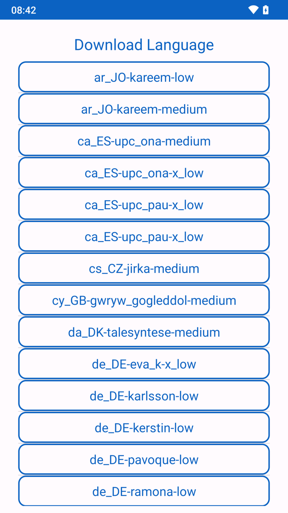
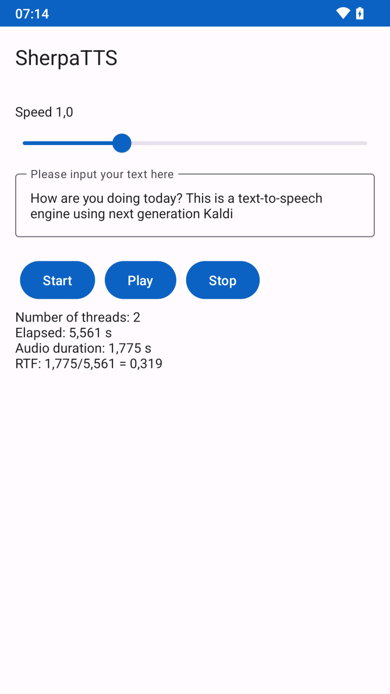

## Donate
<pre>Send a coffee to 
woheller69@t-online.de 

  
Or via this link (with fees)
</pre>
# SherpaTTS

SherpaTTS is an Android Text-to-Speech engine based on Next-gen Kaldi. It uses voices from [Piper Voices](https://rhasspy.github.io/piper-samples/) or [Coqui](https://github.com/coqui-ai/TTS/).

 

 

## Initial Setup

Upon launching SherpaTTS for the first time, the app will download your preferred voice model from Hugging Face. 
Please note that this is the only instance where internet permission is required. 
Once the model is downloaded, text-to-speech works entirely offline, ensuring your privacy and convenience.
Voices can be tested [here](https://huggingface.co/spaces/k2-fsa/text-to-speech/).

## Contribute
For translations use https://toolate.othing.xyz/projects/sherpatts/

# License
This work is licensed under GPLv3 license, © woheller69

- This app is based on the [Sherpa ONNX Project](https://github.com/k2-fsa/sherpa-onnx), published under Apache-2.0 license
- It uses data from [eSpeak NG](https://github.com/espeak-ng/espeak-ng), published under GPLv3 license
- At first start it downloads and installs a Piper or Coqui voice model from Hugging Face. 

# OTHER APPS

| **RadarWeather** | **Gas Prices** | **Smart Eggtimer** |
|:---:|:---:|:--:|
|  |  |  |
| **Bubble** | **hEARtest** | **GPS Cockpit** |
|  |  |  |
| **Audio Analyzer** | **LavSeeker** | **TimeLapseCam** |
|  | |  |
| **Arity** | **Cirrus** | **solXpect** |
|  |  |  |
| **gptAssist** | **dumpSeeker** | **huggingAssist** |
|  |  |  |
| **FREE Browser** | **whoBIRD** | **PeakOrama** |
|  |  |  |
| **Whisper** | **Seamless** | **SherpaTTS** |
|  |  |  |
